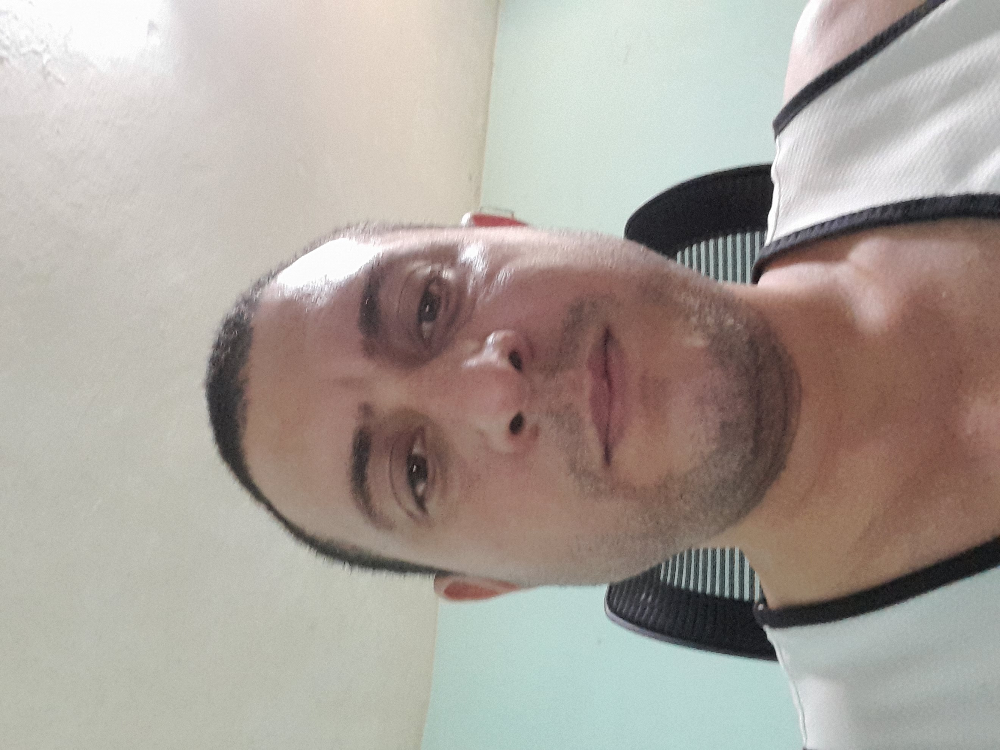

# Currículum Vitae — Javier Fernández Vaca

> **📄 Versión web interactiva:**
> **[👉 Ver Portfolio Online](https://javierfernandezvaca.github.io/Curriculum-Vitae/)** · *Powered by GitHub Pages*

---

<table>
  <tr>
    <td style="width: 200px; vertical-align: top;">
      
    </td>
    <td style="vertical-align: top; padding-left: 20px;">
      <strong>Nombre:</strong> Javier Fernández Vaca 
      <strong>Cargo:</strong> Ingeniero de Software Profesional  
      <strong>E-mail:</strong> javierfernandezvaca@gmail.com 
      <strong>Teléfono:</strong> +53 56073219 
      <strong>Dirección:</strong> 5 Norte E/ 4 y 5 Este, Rpto. Rio Guaso, Guantánamo, Cuba   
      <strong>Última actualización:</strong> 17 de febrero de 2026
    </td>
  </tr>
</table>

## Resumen Profesional

Ingeniero de Software con más de 13 años de experiencia en el desarrollo full-stack de aplicaciones web y móviles (Flutter, Ionic, Angular), y en la docencia universitaria. Enfocado en la creación de soluciones tecnológicas innovadoras y la formación de nuevos profesionales en ingeniería informática.

## Índice

- [Experiencia Profesional](#experiencia-profesional)
- [Educación](#educación)
- [Formación Universitaria](#formación-universitaria)
- [Habilidades Técnicas](#habilidades-técnicas)
- [Trabajos Realizados](#trabajos-realizados) (19 proyectos)

## Experiencia Profesional

- **Ingeniero de Software**
    - **Institución**: Freelancer (Remoto) – `Cuba`
    - **Período**: `Septiembre 2015 – Presente`
    - **Descripción**:
    Especializado en el desarrollo de aplicaciones profesionales de propósito general.

- **Profesor**
    - **Institución**: Universidad de Guantánamo – `Cuba`
    - **Período**: `Septiembre 2015 – Presente`
    - **Descripción**:
    Especializado en la formación de nuevos profesionales en la Facultad de Ingeniería Informática.

## Educación

- **Universidad de Oriente** – Cuba
  - Licenciatura en Ciencias de la Computación (2006 – 2011)

- **Universidad de Guantánamo** – Cuba
  - Profesor Instructor (2015)
  - Profesor Asistente (2020)

## Formación Universitaria

**Universidad de Oriente** – Licenciatura en Ciencias de la Computación

- Programación en C/C++
- Estructura de Datos y Algoritmos
- Diseño y Análisis de Algoritmos
- Sistemas de Bases de Datos
- Redes de Computadoras
- Sistemas Operativos
- Lenguajes de Programación
- Técnicas de Compilación
- Ingeniería de Software
- Inteligencia Artificial
- Reconocimiento de Patrones

## Habilidades Técnicas

- **Mobile:** Flutter y Ionic (Experto), Kotlin Multiplatform (Intermedio)
- **Frontend:** HTML, CSS, JavaScript y Angular (Experto), React y Vue (Intermedio)
- **Backend:** Go (Avanzado), PHP/Laravel, Java/Spring Boot, Node/NestJS y .NET Core (Intermedio)
- **Desktop:** C/C++ (Experto)

## Trabajos Realizados

Empresas y Clientes Privados

- **Proyecto**: Serena Care
  - **Empresa/Cliente**: idooGROUP Technologies Inc (México)
  - **Tecnología**: Flutter
  - **Descripción**: Desarrollé la aplicación móvil multiplataforma para Serena Care, una red de residencias especializadas en atención integral para adultos mayores en Baja California. La app centraliza servicios asistenciales como atención médica, programas de bienestar y respuesta a emergencias 24/7. Implementé módulos para seguimiento clínico y acceso a información de centros certificados (**ISO 9001:2015**, Registro **REPSSABI**), garantizando estándares de calidad internacional.
  - **Enlaces**: [Web](https://serenacare.net/en/home-eng/)
  - **Período**: Mayo 2025 – Enero 2026

- **Proyecto**: INDEX
  - **Empresa/Cliente**: idooGROUP Technologies Inc (México)
  - **Tecnología**: Flutter
  - **Descripción**: Desarrollé la aplicación móvil multiplataforma que conecta a trabajadores con los beneficios de su sindicato, permitiendo gestionar trámites, responder cuestionarios de bienestar (incluyendo NOM‑035), inscribirse a eventos y acceder a cupones desde un solo lugar. Integré notificaciones en tiempo real, autenticación segura y accesos directos a servicios empresariales.
  - **Enlaces**: [Web](https://index.idooproject.com/)  
  - **Período**: Agosto 2024 – Enero 2026

- **Proyecto**: Das Cortez
  - **Empresa/Cliente**: idooGROUP Technologies Inc (México)
  - **Tecnología**: Flutter
  - **Descripción**: Participé en el desarrollo de la aplicación móvil multiplataforma para Das Cortez, una marca especializada en cafés finos y productos premium. Implementé módulos clave para mejorar la experiencia de compra, navegación de catálogo, gestión de productos y flujo de pedidos, optimizando la operación del cliente y facilitando la venta de café, gift cards y artículos relacionados.
  - **Enlaces**: [Web](https://dascortez.com/)
  - **Período**: Abril 2025 – Junio 2025

- **Proyecto**: eVisas
  - **Empresa/Cliente**: Grupo Business IT, Cancillería del Gobierno de Ecuador (Ecuador)
  - **Tecnología**: Angular
  - **Descripción**: Desarrollé módulos clave para e‑Visas, el sistema oficial del Gobierno de Ecuador para la gestión electrónica de visas, disponible 24/7 y 100% en línea. Contribuí tanto a la interfaz pública para solicitantes como al panel administrativo interno, implementando flujos críticos para la solicitud, cancelación y transferencia de visas, así como validaciones, formularios dinámicos y mejoras de usabilidad orientadas a reducir errores y agilizar trámites.
  - **Enlaces**: [Web](https://serviciosdigitales.cancilleria.gob.ec/authentication)
  - **Período**: Junio 2024 – Junio 2024

- **Proyecto**: Swin Drinks
  - **Empresa/Cliente**: Swin Soft, LLC (Estados Unidos)
  - **Tecnología**: Flutter
  - **Descripción**: Desarrollé la aplicación móvil multiplataforma para Swin Drinks, una plataforma diseñada para optimizar la operación de bares, clubes y eventos en la industria de la vida nocturna. Implementé funcionalidades clave como pedidos in‑app para incrementar ingresos, "Flash Passes" para acceso prioritario y un sistema de gestión de eventos en tiempo real que permite a los administradores tomar decisiones operativas basadas en datos.
  - **Enlaces**: [Web](https://www.swindrinks.com/)
  - **Período**: Diciembre 2023 – Junio 2024

- **Proyecto**: Street Rent a Car
  - **Empresa/Cliente**: idooGROUP Technologies Inc (México)
  - **Tecnología**: Flutter
  - **Descripción**: Desarrollé la aplicación móvil multiplataforma para Street Rent a Car, una empresa mexicana de alquiler de vehículos con presencia en múltiples sucursales. Implementé un sistema de reservas intuitivo conectado a una flota diversa, gestión completa del ciclo de alquiler, un programa de recompensas y la integración de descuentos exclusivos para aumentar la fidelización y las conversiones. También optimicé la experiencia del usuario en procesos clave como selección de vehículo, fechas, sucursal, disponibilidad y métodos de pago, alineando la app con la estructura y servicios ofrecidos en dicha empresa.
  - **Enlaces**: [Web](https://streetrentacar.com.mx/) · [App Store](https://apps.apple.com/mx/app/street-rent-a-car/id6478752296) · [Play Store](https://play.google.com/store/apps/details?id=com.idoogroup.srac)
  - **Período**: Noviembre 2023 – Junio 2024

- **Proyecto**: Stream Dealer
  - **Empresa/Cliente**: idooGROUP Technologies Inc (México)
  - **Tecnología**: Flutter
  - **Descripción**: Desarrollé la aplicación móvil multiplataforma Stream Dealer, un marketplace especializado en cartas coleccionables y productos relacionados. Implementé funcionalidades clave como publicación y gestión de artículos, compra y venta segura, búsqueda avanzada por colección y rareza, sistema de favoritos, inventario personal y herramientas para conectar a compradores y vendedores dentro de una comunidad activa. La app fue construida con Flutter, optimizando rendimiento, navegación y experiencia de usuario para un flujo de comercio ágil y confiable.
  - **Enlaces**: [Play Store](https://play.google.com/store/apps/details?id=app.streamdealer.com)
  - **Período**: Junio 2023 – Noviembre 2023

- **Proyecto**: Good Crown v2
  - **Empresa/Cliente**: Privado (Estados Unidos)
  - **Tecnología**: Flutter
  - **Descripción**: Implementé la aplicación móvil multiplataforma para una red social exclusiva, mejorando significativamente la experiencia del usuario. (Proyecto bajo acuerdo de confidencialidad).
  - **Período**: Mayo 2023 – Septiembre 2023

- **Proyecto**: SINI
  - **Empresa/Cliente**: Deneb Latinoamericana, Inc. (USA) / Defensa Civil del Gobierno Dominicano
  - **Tecnología**: Flutter
  - **Descripción**: Implementé la aplicación móvil oficial "AlertaDO" para la Defensa Civil y el Sistema Integrado Nacional de Información (SINI). Esta herramienta es clave para la gestión de riesgos en República Dominicana y el Caribe, permitiendo a los ciudadanos reportar incidencias de forma ágil y segura. Desarrollé el sistema de alertas tempranas para notificar amenazas naturales y antrópicas en tiempo real, garantizando una respuesta oportuna ante situaciones de peligro.
  - **Enlaces**: [Play Store](https://play.google.com/store/apps/details?id=do.sini.alertado) · [Carta de recomendación](deneb_recommendation_letter.pdf)
  - **Período**: Febrero 2023 – Julio 2023

- **Proyecto**: CUSAF
  - **Empresa/Cliente**: Deneb Latinoamericana, Inc. (USA)
  - **Tecnología**: Flutter
  - **Descripción**: Implementé una aplicación móvil multiplataforma de gestión agrícola empresarial para el proyecto AgroFor. Desarrollé módulos para la optimización de procesos clave, el seguimiento de la producción en tiempo real y el análisis de datos, mejorando la toma de decisiones estratégicas para las operaciones agrícolas del cliente.
  - **Enlaces**: [Web](https://www.agrofor.info/) · [Carta de recomendación](deneb_recommendation_letter.pdf)
  - **Período**: Enero 2023 – Julio 2023

- **Proyecto**: Ganaclima
  - **Empresa/Cliente**: Deneb Latinoamericana, Inc. (USA)
  - **Tecnología**: Flutter
  - **Descripción**: Desarrollé la app móvil para GanaclimaRD, iniciativa nacional asistida por la FAO, que ayuda a los agricultores a adoptar prácticas climáticamente inteligentes para reducir emisiones y aumentar la productividad.
  - **Enlaces**: [Web](https://ganaderiayclimard.do/ganaclima/) · [Carta de recomendación](deneb_recommendation_letter.pdf)
  - **Período**: Octubre 2022 – Julio 2023

- **Proyecto**: SUPI Plus
  - **Empresa/Cliente**: CademSmart (Chile)
  - **Tecnología**: Flutter
  - **Descripción**: Implementé la app móvil de auditoría para la firma de inteligencia de mercado CademSmart. La herramienta digitaliza el levantamiento de datos en el punto de venta, permitiendo a los auditores de campo registrar información crítica como disponibilidad de stock, precios y cumplimiento de promociones en tiempo real para los clientes B2B de la compañía.
  - **Enlaces**: [App](https://app.cademsmart.com/) · [APK](https://apkpure.net/de/supi-mobile/com.cademsmart.supimobile)
  - **Período**: Febrero 2022 – Diciembre 2022

- **Proyecto**: Xpertopolis
  - **Empresa/Cliente**: Peoplewalking (España)
  - **Tecnología**: Ionic & Angular
  - **Descripción**: Implementé el programa de certificación profesional para Xpertopolis, una innovadora plataforma de contratación que utiliza IA y Blockchain para eliminar sesgos. Mi desarrollo fue clave para certificar objetivamente las habilidades técnicas de los desarrolladores en Ionic y Angular, asegurando la fiabilidad y transparencia en el proceso de selección de expertos.
  - **Enlaces**: [Web](https://xpertopolis.com/) · [Peoplewalking](https://www.peoplewalking.com/)
  - **Período**: Julio 2022 – Diciembre 2022

- **Proyecto**: Business Series Tool
  - **Empresa/Cliente**: Peoplewalking (España)
  - **Tecnología**: Ionic & Angular
  - **Descripción**: Implementé la aplicación web para la gestión, actualización y soporte del proyecto Business Series Tools, mejorando la eficiencia operativa del equipo.
  - **Enlaces**: [Peoplewalking](https://www.peoplewalking.com/)
  - **Período**: Junio 2021 – Diciembre 2022

- **Proyecto**: Good Crown v1
  - **Empresa/Cliente**: idooGROUP Technologies Inc (México)
  - **Tecnología**: Flutter
  - **Descripción**: Implementé la aplicación móvil multiplataforma innovadora para una red social exclusiva con funcionalidades comerciales integradas. (Proyecto bajo acuerdo de confidencialidad).
  - **Período**: Noviembre 2020 – Mayo 2021

- **Proyecto**: CIMEMP
  - **Empresa/Cliente**: idooGROUP Technologies Inc (México)
  - **Tecnología**: Ionic & Angular
  - **Descripción**: Implementé CIMEMP, una aplicación móvil crucial para la gestión de la salud en empresas estatales mexicanas durante la pandemia. Desarrollé sus funciones clave, incluyendo el registro de análisis clínicos, seguimiento de síntomas y generación de reportes, para facilitar una detección temprana y una gestión eficiente de los casos de COVID-19.
  - **Enlaces**: [Portfolio](https://www.idoogroup.com/en/portfolio/project-cimemp/)
  - **Período**: Julio 2020 – Septiembre 2020

- **Proyecto**: COVID 19 Test
  - **Empresa/Cliente**: idooGROUP Technologies Inc (México)
  - **Tecnología**: Ionic & Angular
  - **Descripción**: Implementé la aplicación móvil multiplataforma especializada en la detección y seguimiento de casos COVID-19, optimizando la gestión sanitaria para el sector privado.
  - **Período**: Abril 2020 – Junio 2020

- **Proyecto**: GETRIX
  - **Empresa/Cliente**: Instapack (España)
  - **Tecnología**: HTML, CSS, JavaScript, jQuery y Bootstrap
  - **Descripción**: Implementé GETRIX, la aplicación web de cliente para la empresa de mensajería instantánea Instapack. Mi desarrollo fue clave para su sistema de seguimiento, permitiendo a los usuarios visualizar el repartidor en un mapa en tiempo real, recibir notificaciones detalladas del progreso y contactar directamente al mensajero, mejorando radicalmente la transparencia en la logística.
  - **Enlaces**: [Web](https://www.instapack.es/)
  - **Período**: Enero 2018 – Julio 2018

- **Proyecto**: FULLSTACK
  - **Empresa/Cliente**: Universidad de Guantánamo (Cuba)
  - **Tecnología**: Todas las Habilidades Técnicas
  - **Descripción**: Lidero el desarrollo de soluciones tecnológicas innovadoras y aplicaciones de propósito general para empresas nacionales y universidades cubanas.
  - **Período**: Septiembre 2011 – Presente
